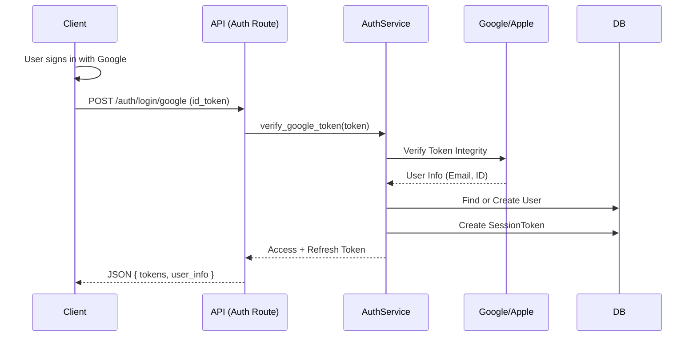
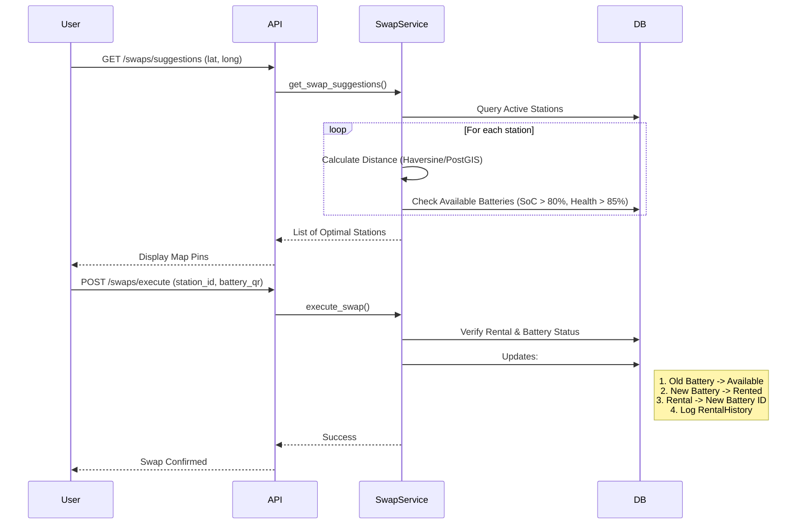

# WEZU Backend - System Architecture & Flow

This document details the technical architecture, data flows, and component interactions of the WEZU Backend.

## 🏗 High-Level Architecture

The system follows a **Modular Monolith** architecture with a clear separation of concerns, designed for high performance using **FastAPI** (Async) and **SQLModel**.

```mermaid
graph TD
    Client[Mobile App / Web Dashboard] -->|HTTPS| LB[Load Balancer / Nginx]
    LB --> API[FastAPI Application]
    
    subgraph "Application Layer"
        API -->|Validates| AuthMid[Auth Middleware & Deps]
        AuthMid -->|Routes| Routers[API Routers (v1)]
        Routers -->|Calls| Services[Service Layer]
    end
    
    subgraph "Data & State"
        Services -->|Reads/Writes| DB[(PostgreSQL + TimescaleDB)]
        Services -->|Cache/Queue| Redis[(Redis)]
        Services -->|Async Tasks| Celery[Celery Workers]
    end
    
    subgraph "External Integrations"
        Services -->|Payments| Razorpay[Razorpay]
        Services -->|Notifications| FCM[Firebase Cloud Messaging]
        Services -->|Auth| OAuth[Google / Apple / Facebook]
    end
    
    subgraph "IoT Ecosystem"
        IoT[Battery / Station HW] -->|MQTT| Broker[MQTT Broker]
        Broker -->|Subscribes| MQTTService[MQTT Service]
        MQTTService -->|Hot Storage| Redis
        MQTTService -->|Cold Storage| DB
    end
```

---

## 🔄 Core Data Flows

### 1. Request Lifecycle (Standard API)
Every API request follows this path:
1.  **Entry**: Request hits `app/main.py`.
2.  **Middleware**:
    *   `CORSMiddleware`: Checks allowed origins.
    *   `GZipMiddleware`: Compresses responses.
    *   `RateLimitMiddleware`: Checks Redis for rate limits.
3.  **Routing**: Dispatched to `app/api/v1/` based on prefix (e.g., `/users`, `/swaps`).
4.  **Dependencies (`app/api/deps.py`)**:
    *   `get_db()`: Creates a scoped DB session.
    *   `get_current_user()`: Validates JWT, checks `BlacklistedToken`, and verifies User existence/status.
5.  **Service Layer**: Router calls specific service (e.g., `BatteryService.get_battery()`).
6.  **Database**: Service interacts with `SQLModel` models.
7.  **Response**: Pydantic schemas serialize data back to JSON.

### 2. Authentication Flow (Google/Apple/Social)
Handles secure user onboarding and session management.


### 3. Battery Swap Flow
Critical business logic for finding stations and executing swaps.


### 4. IoT Telemetry Ingestion (Real-time)
Handles high-frequency data from batteries.
1.  **Source**: Battery BMS sends JSON payload via MQTT to `wezu/batteries/{id}/telemetry`.
2.  **Ingestion**: `app/services/mqtt_service.py` listens to topic.
3.  **Processing**:
    *   **Hot Path**: Data stored in **Redis** with 5-min TTL for real-time app dashboard usage (`get_realtime_data`).
    *   **Cold Path**: `TelematicsService` writes to **TimescaleDB** for historical analysis.
    *   **Alerting**: Checks thresholds (Temp > 45°C, SoC < 10%). If triggered, pushes alert to Redis and triggers Notification Service.

---

## 📂 Directory Structure & Module Responsibilities

| Directory | Role | Key Files |
|-----------|------|-----------|
| `app/api/v1` | **Controllers**: Validates inputs, calls services. | `auth.py`, `swaps.py`, `batteries.py` |
| `app/services` | **Business Logic**: Complex rules, transactions. | `swap_service.py`, `auth_service.py` |
| `app/models` | **Data Access**: DB Schemas & Relationships. | `user.py`, `battery.py`, `rental.py` |
| `app/core` | **Config**: Settings, Security, DB connect. | `config.py`, `security.py`, `database.py` |
| `app/workers` | **Background**: Scheduled tasks. | `celery_app.py`, `tasks.py` |

## 🛠 Key Technology Decisions
*   **FastAPI**: Chosen for native Async support (critical for IoT/Chat) and auto-generated OpenApi docs.
*   **SQLModel**: Combines Pydantic verification with SQLAlchemy ORM ease of use.
*   **TimescaleDB**: Optimizes storage for millions of battery telemetry rows.
*   **Redis**: Used for caching (rate limits, session storage) and real-time state (current battery metrics).
